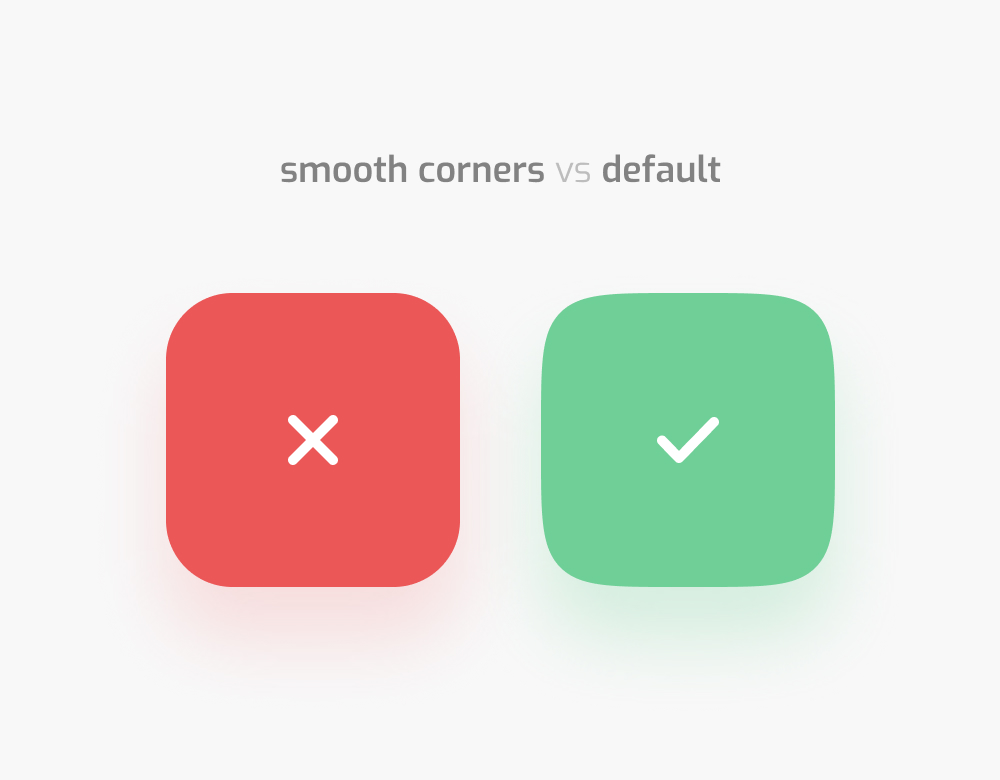

# Smooth Component

a react component to implement container or element with smoothing corners.



## Install

```bash
npm install --save smooth-component
```

## Usage

```jsx
import React, { Component } from 'react'

import Smooth from 'smooth-component'

class Example extends Component {
  render() {
    return (
      <Smooth.div
        borderRadius={100}
        cornerSmoothing={100}
        style={{ width: 200, height: 200 }}
      >
        ...
      </Smooth.div>
    )
  }
}
```

Supported tags : `div`, `img`, `p`, `h1`, `h2`, `h3`, `h4`, `h5`, `h6`

## Props

| key             | type                          | example               |
| --------------- | ----------------------------- | --------------------- |
| borderRadius    | number / string ( `px or %` ) | `93` / `93px` / `93%` |
| cornerSmoothing | number / string ( `%` )       | `63` / `63%`          |
